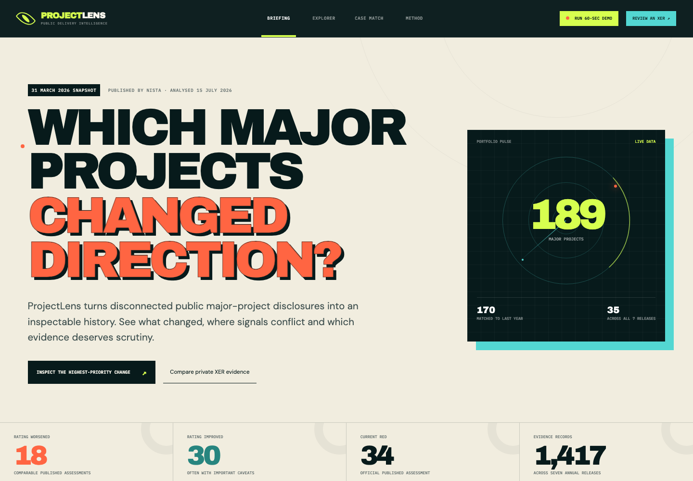
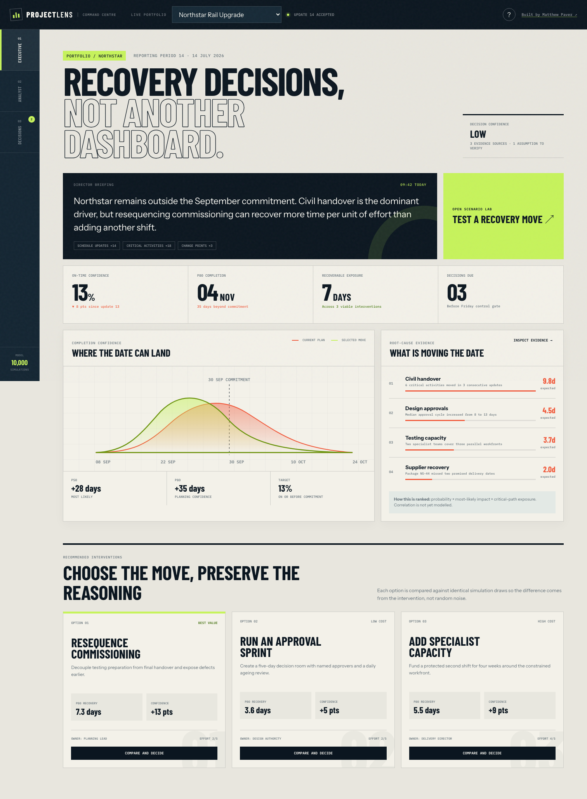
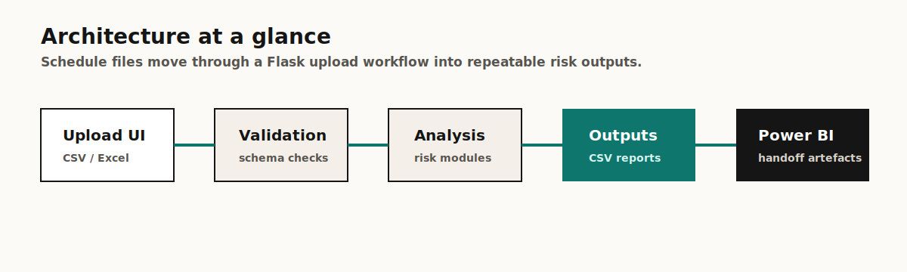

# ProjectLens

<div align="center">


[](https://github.com/MatthewPaver/ProjectLens/actions/workflows/validate.yml)

**Explainable schedule-risk analysis and recovery decision support**

ProjectLens turns schedule analysis into accountable recovery decisions, then checks whether those decisions worked.

</div>





---

## Portfolio Quick Read

| Section | Where to look |
|:---|:---|
| What it solves | Turns schedule-risk evidence into accountable recovery decisions |
| Live command centre | [Open the interactive decision-support demo](https://matthewpaver.github.io/ProjectLens/) |
| Quick start | [`make serve`](#canonical-setup) or [`make pipeline`](#running-the-pipeline-directly) |
| Screenshot | [Portfolio Store](https://matthewpaver.github.io/MatthewPaver/store/) |
| Architecture | [What The Pipeline Does](#what-the-pipeline-does) |
| Tests | `make test` |
| Tech stack | `Python` `Flask` `pandas` `statsforecast` `Power BI` |

## Status

`Runnable application`

ProjectLens combines:

- a Flask web interface in [`Website/`](Website)
- a data processing pipeline in [`Processing/`](Processing)
- a transparent Monte Carlo decision engine in [`Processing/analysis/decision_support.py`](Processing/analysis/decision_support.py)
- a portable executive and analyst command centre in [`docs/`](docs)
- structured input/output folders under [`Data/`](Data)

## What changed in v2

The original application surfaced schedule analysis outputs. The command centre adds the decision layer required in a project-controls meeting:

- executive and analyst views with different information density
- P10, P50, P80 and on-time confidence ranges
- evidence-linked root-cause ranking
- intervention comparison using common random numbers
- recommended recovery moves with effort, ownership and expected impact
- a decision ledger that records promised and observed recovery
- exportable decision briefs with explicit model boundaries

The public demonstration uses synthetic data. Recommendations are explainable prompts for professional review, not autonomous schedule changes.

## Market gap

The schedule-risk market already contains deep diagnostics, Monte Carlo tools, AI summaries and scenario modelling. ProjectLens therefore focuses on a narrower operational gap: preserving the path from evidence, to selected intervention, to named owner, to measured outcome at the next reporting cycle.

The dated quick scan and source notes are available in [`competitor-profiles/`](competitor-profiles).

## Decision model

Each risk driver has a probability, triangular day-impact range and critical-path exposure. A seeded simulation produces completion ranges. Interventions reduce specific driver impacts, and every scenario uses the same random draws as the baseline so differences are attributable to the intervention rather than sampling noise.

Root causes are ranked using an inspectable expected-contribution score:

```text
expected delay = probability × most-likely impact × critical-path exposure
```

This deliberately simple model is suitable for scenario comparison and demonstration. Production use would require dependency correlation, calibrated distributions, access controls, secure storage and organisational validation.

## Reviewer Pack

| Area | Details |
|:---|:---|
| What it solves | Project schedule files become evidence-linked risks, comparable interventions and reviewable decisions. |
| Screenshot | [Portfolio Store preview](https://matthewpaver.github.io/MatthewPaver/store/preview.html?app=projectlens) |
| Run locally | `make install && make serve`, then open `http://127.0.0.1:5000` |
| Pipeline only | `make pipeline` |
| Tests | `make test` |
| Demo data | Sample project folders and output examples are included under `Data/`. |
| Architecture | Flask upload UI -> cleaning and forecasting -> decision model -> executive/analyst command centre -> decision ledger |
| Limitations | Designed as a local portfolio application; production use would need auth, storage hardening, and deployment packaging. |

## Practical Test

Can a project schedule update become a useful, reviewable recovery decision?

The useful check is the full path:

1. Upload or place schedule data in the expected folder.
2. Clean and standardise the file.
3. Run slippage, milestone, changepoint, and forecast checks.
4. Compare interventions against identical simulation draws.
5. Commit a decision with an owner, expected recovery and review point.
6. Compare promised recovery with the next observed schedule update.

That is the point of the app: close the gap between seeing schedule risk and acting on it accountably.

## Reviewer Notes

- **Reproducible path:** root `requirements.txt` and `make` targets are the supported setup route.
- **Product signal:** the Flask UI wraps the analysis pipeline so a reviewer can use the workflow, not just read code.
- **Analytics signal:** slippage, milestone pressure, changepoint detection, and forecasting are separated into pipeline outputs.
- **Verification path:** run `make test`, then `make serve` or `make pipeline` depending on whether you want the UI or batch flow.

## Canonical Setup

The canonical dependency entry point for this repo is the root [`requirements.txt`](requirements.txt).

### Option 1: Standard local setup

```bash
python3.11 -m venv .venv
source .venv/bin/activate
python -m pip install --upgrade pip
python -m pip install -r requirements.txt
python Website/server.py
```

Open `http://127.0.0.1:5000`.

### Option 2: Convenience targets

```bash
make install
make serve
```

### Option 3: Bootstrap script

If you want the repo to create and manage `.venv` for you:

```bash
python3.11 Website/run_website.py
```

## Running The Pipeline Directly

```bash
python3.11 Processing/main.py
```

Or with the Makefile:

```bash
make pipeline
```

Results are written to `Data/output/<project_name>/`.

## What The Pipeline Does



- validates project input structure
- loads CSV and Excel source files
- runs slippage, milestone, changepoint, and forecasting analysis
- writes output files suitable for downstream review and Power BI use
- archives processed inputs

## Repository Layout

```text
Data/         input, output, archive, and schema assets
Processing/   pipeline logic and tests
Website/      Flask server, templates, and static assets
Output/       Power BI dashboard artefacts
```

## Notes

- Python `3.11` is the supported runtime for the packaged flows in this repo.
- Root `requirements.txt` is canonical.
- `Processing/requirements.txt` is kept only as a compatibility shim for older workflows.

## License

MIT. See [`LICENSE`](LICENSE).
