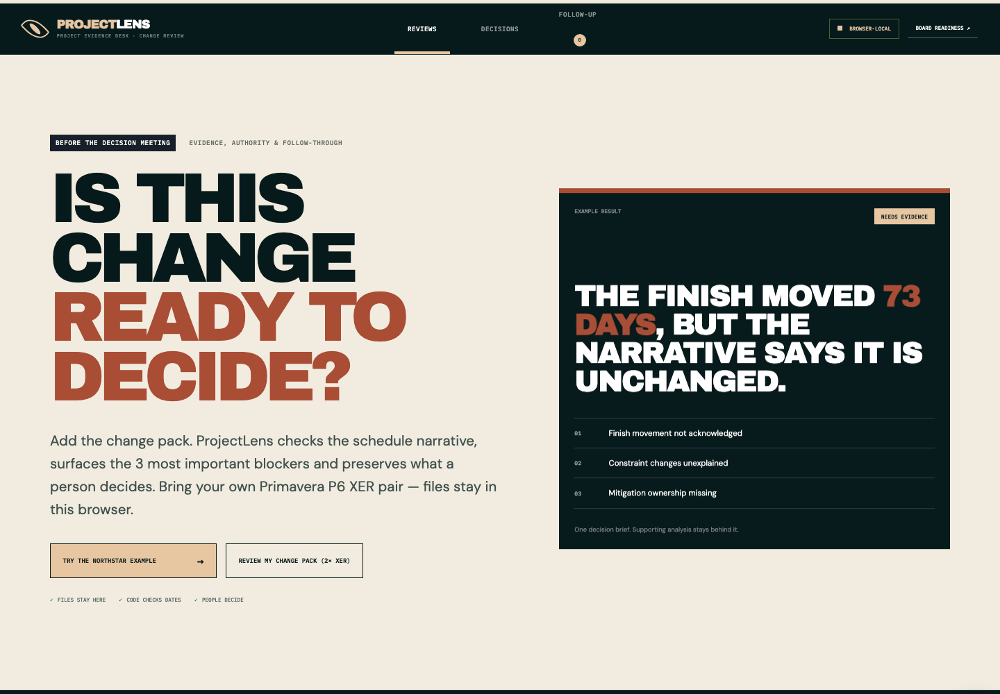

# ProjectLens

ProjectLens is built for the reviewer who has to tell a project board whether a change pack can be trusted — before the meeting, using only the pack's own evidence.

[](https://github.com/MatthewPaver/ProjectLens/actions/workflows/validate.yml)


**Try it now — no install, no account.** Everything runs in the browser; XER files, decisions and conditions never leave your machine.

- [Review a change pack](https://matthewpaver.github.io/ProjectLens/change-assurance.html) — the primary workflow: register evidence, check conflicts, record the board decision.
- [Prepare a board review](https://matthewpaver.github.io/ProjectLens/board-readiness.html)
- [Detailed XER schedule review](https://matthewpaver.github.io/ProjectLens/schedule-review.html) — select **Run the Northstar demo** for a one-click run on bundled synthetic fixtures.
- [Explore the public GMPP evidence](https://matthewpaver.github.io/ProjectLens/)

**Run it locally** (commands match the [`Makefile`](Makefile)):

```bash
make install       # create .venv and install dependencies
make test          # pytest suite
make browser-test  # Playwright browser suite
make public-data   # rebuild docs/data/gmpp.json from Data/public/raw/
python -m http.server 8000 --directory docs   # serve the product at http://localhost:8000
```

**Know the limits before relying on a finding:** see [Non-goals](#non-goals) and [Boundaries](#boundaries).

## The problem

A project board usually decides on the polish of the pack, because nobody has time to reconcile the narrative against the schedules, risks, actions and prior conditions submitted alongside it. That is how a green status narrative claiming "no change to the finish date" gets approved while the current schedule has actually moved it by 73 days — exactly the failure the bundled Northstar example reproduces, alongside a high risk with no accountable owner, an overdue action and a prior approval condition still open. When the evidence disagrees with the story and no one checks, the board approves the story.

**Who it's for:** the project controls reviewer or PMO lead preparing a board decision on a change pack.

**What you get:**

- **Source-linked conflicts and gaps** — each finding names the evidence item that produced it (current pack, previous pack, RAID, commitments, schedule).
- **A prepared decision, not a dashboard** — one readiness verdict, at most three blockers, and the specific questions to send for answers before the meeting.
- **A durable record** — the human decision, its owner, rationale and approval conditions are preserved, and each condition stays open until it is closed or formally waived.



[**2-minute walkthrough**](docs/assets/projectlens-evidence-demo.mp4) — a paced, silent MP4 product tour.

## Non-goals

- It does not establish contractual entitlement, delay causation or a probability of failure — findings are prompts for human verification, not claims.
- It does not replace the board. The workflow ends by recording a human decision with its rationale and conditions; the system never makes the decision.
- It does not read Microsoft Project (MSP) or PDF schedules. The browser workflows parse Primavera P6 XER exports and CSV evidence only.

## Why this design

The central trade-off is browser-local XER comparison instead of a hosted platform. Schedule submissions are commercially sensitive, so the comparison runs entirely in the browser: XER files, decisions and conditions never leave the machine, which also means a reviewer can evaluate the product against a real pack with no install, no account and no data-sharing approval. The cost is deliberate: records persist only in one browser's local storage, there is no multi-user collaboration, and there are no server-side schedule connectors, permissions or organisational audit logs — a production internal version would need all of those (see Boundaries). That trade is acceptable because the target user is a single reviewer preparing one board meeting, and the fastest route to trust is letting them test it on private data without asking anyone's permission.

## The Northstar demo

Open [the live schedule evidence review](https://matthewpaver.github.io/ProjectLens/schedule-review.html) and select **Run the Northstar demo**. The synthetic pair is safe to share and intentionally contains:

- a 73-day project finish movement
- 22 raw changes reduced to 9 material changes and 8 executive priorities
- a separate baseline, risk register, schedule basis and decision log
- changed logic, constraints, float erosion and integrity findings
- an approved change, an unlinked change and a deferred decision
- a status narrative that understates the schedule movement
- a previous intervention that can be assessed against the later submission

You can switch between executive and analyst views, inspect why each change was prioritised, save assurance actions in the browser and download the complete evidence-linked review pack as JSON.

Users can also register their own evidence locally in the browser; the detailed schedule module parses XER and CSV evidence without uploading it.

## Bring your own XER

The [change assurance review](https://matthewpaver.github.io/ProjectLens/change-assurance.html) works on your own schedules, not just the demo:

1. Export two Primavera P6 schedules as XER files (**File → Export → Primavera XER (.xer)**): the comparison point (previous update or baseline) and the latest submission.
2. Open the review, select **Review my change pack**, and choose the two files. They are parsed in your browser and never uploaded.
3. Paste the progress narrative that accompanied the update (optional, but required for contradiction checks).
4. Run the check, resolve or accept the blockers, and record the decision.

No XER to hand? Use the safe synthetic pair from the demo: [northstar-previous.xer](https://matthewpaver.github.io/ProjectLens/demo/northstar-previous.xer) and [northstar-current.xer](https://matthewpaver.github.io/ProjectLens/demo/northstar-current.xer).

The parser is exercised against the bundled Northstar fixtures; real-world XER exports vary, and the [Boundaries](#boundaries) section describes what ProjectLens deliberately does not attempt.

## Public evidence

Beyond the private change-pack workflow, ProjectLens joins seven annual Government Major Projects Portfolio releases into an inspectable history: which published delivery-confidence ratings worsened, which end dates changed and by how much, what explanations departments are publishing, and which projects have left the portfolio without a confirmed outcome. The full method, the score definition and the current evidence-base counts are in [`docs/method.md`](docs/method.md). Source links and licensing notes are in [`Data/public/README.md`](Data/public/README.md).

To rebuild the validated dataset locally, run `make public-data`; it reads the unmodified annual CSV files under `Data/public/raw/` and writes `docs/data/gmpp.json`.

## Tests

```bash
make test
make browser-test
```

Tests cover the board-readiness human gate, original schedule-processing modules, public-data counts, DCA precedence, matching, transitions, theme classification, score boundaries and the synthetic XER evidence contract. Playwright checks exercise the board review, one-click change and XER demos, real browser file inputs, exported assurance packs, and desktop and mobile layouts. Both suites run in CI ([`validate.yml`](.github/workflows/validate.yml)).

The legacy Python pipeline reads optional local settings from `config.json`. Copy [`config.example.json`](config.example.json) when exercising that path; the public browser products require no configuration or credentials.

## Boundaries

- Delivery Confidence Assessments are point-in-time judgements, not outcomes.
- Annual portfolio data cannot support activity-level critical-path forecasting.
- Theme matching does not prove root cause.
- Comparable cases prompt investigation and do not prescribe an intervention.
- Absence from a later annual release does not establish whether a project delivered, closed, changed identifier or left the portfolio for another reason.
- XER comparison identifies observable changes and integrity questions. It does not reproduce Primavera scheduling calculations or prove delay attribution.
- Baseline assurance requires a separately supplied baseline because XER does not reliably carry baseline project data. Risk and decision links use explicit activity-code matching and remain prompts for human verification.
- If an XER contains multiple projects, the browser demonstrator analyses the first project and reports that scope limitation.
- A production internal version would require secure schedule connectors, permissions, audit logs and organisation-specific validation.

Oracle describes XER as a proprietary exchange format, notes that baseline project data is not supported in XER export, and documents differences in risk and financial-period transfer. Those format constraints are why the workflow begins with an evidence-completeness report. See Oracle's [supported file formats](https://docs.oracle.com/cd/F51303_01/English/admin/p6_pro_importing_exporting/import_export_file_formats.htm), [XER export notes](https://docs.oracle.com/cd/E75426_01/English/User_Guides/p6_pro_user/export_projects_to_an_xer_file.htm) and [risk import guidance](https://docs.oracle.com/cd/G48897_01/p6help/en/101760.htm).

## Repository layout

```text
docs/                    GitHub Pages product and generated JSON
docs/schedule-review.*   browser-local XER evidence review
docs/demo/               synthetic, share-safe XER and evidence kit
docs/method.md           method detail, evidence-base counts, market position
Data/public/             official annual GMPP source files
Processing/gmpp_pipeline.py
                         longitudinal preparation and validation
Processing/analysis/     legacy schedule-analysis modules, retained for tests
Processing/tests/        deterministic and integration tests
competitor-profiles/     dated market scan and source notes
```

## Related projects

MeetingProof (meeting follow-up) and [DecisionGraph](https://github.com/MatthewPaver/DecisionGraph) (decision memory) are separate supporting tools; neither is required to complete a change review.

## License

ProjectLens code is MIT licensed. Government source data is used under the Open Government Licence. See each official publication for source terms.
