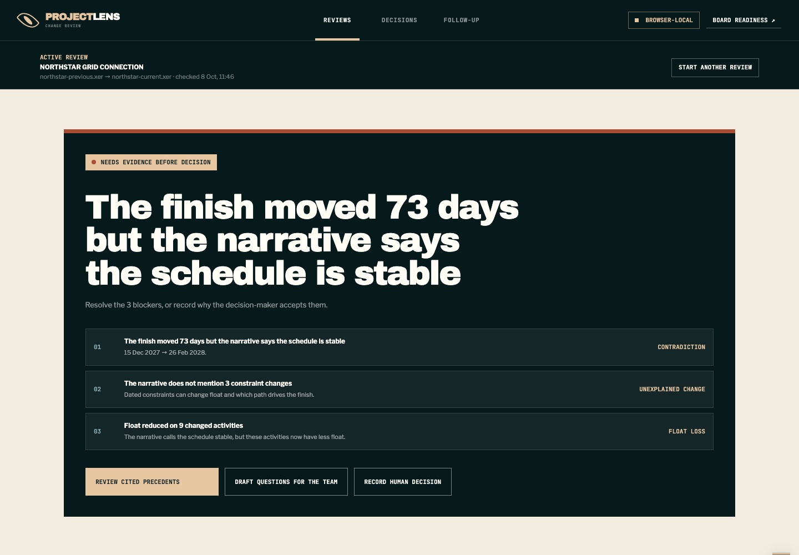
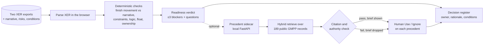

# ProjectLens: checks a change pack against its own evidence

For the project controls reviewer who has to tell a board whether a change pack can be trusted: ProjectLens compares the pack's narrative with its Primavera P6 schedules, risks and prior conditions, shows where they disagree, and records the human decision, all in the browser.

[](https://github.com/MatthewPaver/ProjectLens/actions/workflows/deploy-pages.yml)
[](LICENSE)



**Live demo (no install, no account):** [review a change pack](https://matthewpaver.github.io/ProjectLens/change-assurance.html) · [XER schedule review](https://matthewpaver.github.io/ProjectLens/schedule-review.html) · [board review](https://matthewpaver.github.io/ProjectLens/board-readiness.html) · [public GMPP evidence](https://matthewpaver.github.io/ProjectLens/) · [2-minute walkthrough (MP4)](docs/assets/projectlens-evidence-demo.mp4)

On the change-assurance page, select **Try the Northstar example**. It is a synthetic pack, and the result is one readiness verdict with three blockers and the questions to send the team before the meeting.

## The problem

A board often decides on how polished the pack looks, because nobody has time to reconcile the narrative with the schedules, risks, actions and prior conditions submitted with it. The bundled Northstar example reproduces the failure. Its progress report says there is "no change to the finish date", but the current schedule has moved the finish by 73 days. The same pack also carries a high risk with no owner, an overdue action and an approval condition from the last board that is still open. If nobody checks the evidence against the story, the board approves the story.

ProjectLens gives the reviewer:

- **Source-linked conflicts and gaps.** Each finding names the evidence that produced it: current or previous schedule, risk register, commitments or narrative.
- **A prepared decision, not a dashboard.** One readiness verdict, at most three blockers, and specific questions for the team.
- **A record of the decision.** The decision, its owner, rationale and conditions are kept; each condition stays open until it is closed or formally waived.

## Quickstart

The browser tool is static HTML and JavaScript. Python's built-in server is enough: no packages, no API keys.

```bash
git clone https://github.com/MatthewPaver/ProjectLens.git
cd ProjectLens
python3 -m http.server 8000 --bind 127.0.0.1 --directory docs
# open http://127.0.0.1:8000/change-assurance.html and select "Try the Northstar example"
```

Expected result: the readiness headline reports the 73-day finish movement and the blocker list shows three items. Stop the server with Ctrl+C.

**Your own schedules.** Export two single-project XER files from Primavera P6 (**File → Export → Primavera XER**): the comparison point and the latest submission. Select **Review my change pack**, choose both files and paste the narrative. Files are parsed in the browser and never uploaded. If you have no XER to hand, use the synthetic [Northstar](https://matthewpaver.github.io/ProjectLens/demo/northstar-previous.xer) ([current](https://matthewpaver.github.io/ProjectLens/demo/northstar-current.xer)) or [Riverside](https://matthewpaver.github.io/ProjectLens/demo/riverside-previous.xer) ([current](https://matthewpaver.github.io/ProjectLens/demo/riverside-current.xer), [narrative](https://matthewpaver.github.io/ProjectLens/demo/riverside-narrative.txt)) pairs.

## How it works


```mermaid
flowchart LR
    X[(Two XER exports<br/>+ narrative, risks, conditions)] --> P[Parse XER in the browser]
    P --> R[Deterministic checks<br/>finish movement vs narrative,<br/>constraints, logic, float, ownership]
    R --> V[Readiness verdict<br/>≤3 blockers + questions]
    V -. optional .-> S[Precedent sidecar<br/>local FastAPI]
    S --> H[Hybrid retrieve over<br/>189 public GMPP records]
    H --> C{Citation and<br/>authority check}
    C -- pass, brief shown --> U[Human Use / Ignore<br/>on each precedent]
    C -- fail, brief dropped --> U
    V --> D[Decision register<br/>owner, rationale, conditions]
    U --> D
```

- **Change assurance** (`docs/change-assurance.html`, `.js`): parses both XER files, runs the deterministic checks against the narrative and evidence, and keeps the decision and condition registers in the browser's local storage, with an export of the decision record.
- **Schedule review** (`docs/schedule-review.html`, `docs/xer-review.js`): the detailed XER comparison, reducing raw changes to material ones (on Northstar, 22 raw changes become 9 material changes) with integrity findings.
- **Public evidence** (`docs/index.html`, `Processing/gmpp_pipeline.py`): joins seven annual UK Government Major Projects Portfolio (GMPP) releases into one history of delivery-confidence ratings and end-date changes. Method: [`docs/method.md`](docs/method.md).
- **Precedent sidecar** (`Processing/precedent_rag/`, optional, local): FastAPI plus LangGraph. It retrieves comparable public records with metadata filters and Gemini embeddings. An optional Gemini brief is shown only if every claim cites a retrieved record and it does not recommend approving or rejecting the pack (`summarize.py: evaluate_summary`). It receives narrative text and filters only, never the XER. Method: [`docs/precedent-rag.md`](docs/precedent-rag.md).

To run the sidecar, copy `.env.example` to `.env`, set `GEMINI_API_KEY` (and `LANGSMITH_API_KEY` for traces), then run `make precedent-rag` and set `window.PROJECTLENS_PRECEDENT_RAG_URL = "http://127.0.0.1:8787"` before `change-assurance.js` loads. Without it, the page shows three static precedent cards and the same human gate.

## Results

**Precedent retrieval: hit@5 = 7/8 (88%)** on the offline baseline; hit@3 = 6/8 and hit@1 = 4/8. Reproduced on 2026-10-07:

```bash
make precedent-eval-offline
# or: PYTHONPATH=. .venv/bin/python -m Processing.precedent_rag.cli eval --offline --limit 5
# last line: Hit@5 (offline-hashing): 7/8 = 88%
```

For each of 8 labelled queries in [`eval_queries.json`](Processing/precedent_rag/data/eval_queries.json), it checks whether an expected GMPP record is in the top 5 of the 189-record corpus. It uses the production filter and ranking code with a deterministic SHA-256 token-hashing embedder in place of Gemini, so it needs no key and returns the same number on every run. `test_offline_eval_baseline_is_stable` fails if the number drifts.

What it does not show: 8 author-written queries are a smoke test, not a benchmark. The hashing embedder is a lexical baseline and does not measure the Gemini path (`make precedent-eval`); no Gemini hit rate is published. It scores retrieval only, not the quality of the generated brief.

**Change-assurance behaviour** is checked in a real browser (Playwright). On Northstar the suite asserts the 73-day headline and exactly three blockers. It also exercises real file inputs, the decision and condition flow, exported packs, and mobile layouts. The XER parser is tested on the Northstar and Riverside fixtures plus synthetic format variants (BOM; LF, CRLF and CR line endings; reordered fields). These are not real client exports; see the [parser compatibility contract](docs/PARSER_COMPATIBILITY.md).

## Design decisions and trade-offs

- **Browser-local comparison, not a hosted platform.** Schedule submissions are commercially sensitive, so XER files, decisions and conditions never leave the machine, and a reviewer can try it on a real pack with no install, account or data-sharing approval. The cost: records live in one browser's local storage, with no multi-user working, permissions or organisational audit log.
- **Deterministic rules for schedule findings, not a language model reading the schedule.** Finish movement against the narrative, constraint, logic and float changes, and responses with no owner are calculated in code, so the same pack always gives the same blockers and each one traces to a field. The cost: it finds only what the rules encode, and it reads XER and CSV only.
- **Retrieval is an opt-in sidecar with no localhost probe.** The static site never tries to reach a local server, so the default page makes no failed requests and needs no key. The cost: live precedent retrieval needs a local setup step and an explicit URL.
- **Generated text fails closed and the human decides.** A brief with an invalid or missing citation, or one that recommends approving or rejecting, is dropped rather than shown with a warning. Each precedent still needs **Use** or **Ignore** before the decision register. The cost: some useful briefs are discarded.
- **A reproducible offline eval alongside the live one.** The hashing-embedder baseline runs in CI with no key and cannot drift silently. The alternative, publishing only a Gemini number, could not be reproduced by a reader without a key. The cost: the published number is a lexical floor, not the production path.

## Limits and non-goals

- Findings prompt human verification. ProjectLens does not establish contractual entitlement, delay causation or a probability of failure, and it does not reproduce Primavera scheduling calculations.
- It does not make the decision. The workflow ends by recording a human decision with its rationale and conditions.
- It reads Primavera P6 XER and CSV only, not Microsoft Project or PDF. Change assurance rejects multi-project XER files; schedule review analyses the first project and says so.
- XER does not reliably carry baseline data (see Oracle's [XER export notes](https://docs.oracle.com/cd/E75426_01/English/User_Guides/p6_pro_user/export_projects_to_an_xer_file.htm)), so baseline assurance needs a separately supplied baseline. Risk and decision links use explicit activity-code matching.
- GMPP delivery-confidence ratings are point-in-time judgements, not outcomes. Annual data cannot support activity-level forecasting, and a project's absence from a later release does not show whether it delivered.
- Precedent relevance is a ranking signal, not a confidence or outcome claim. Public records show status, not which intervention worked.
- A production internal version would need secure schedule connectors, permissions, audit logs and organisation-specific validation.

## Repository layout and tests

```text
docs/                         GitHub Pages site (the product)
  change-assurance.*          change pack review and decision register
  schedule-review.*, xer-review.js   detailed XER comparison
  board-readiness.*           board review preparation
  demo/                       synthetic, share-safe XER and evidence files
  data/gmpp.json              generated public dataset
Data/public/raw/              unmodified annual GMPP CSV releases
Processing/gmpp_pipeline.py   builds and validates docs/data/gmpp.json
Processing/precedent_rag/     optional retrieval sidecar and offline eval
Processing/analysis/, core/   earlier CSV schedule-analysis pipeline (make pipeline)
Processing/tests/             pytest suite and Playwright journeys
```

```bash
make test          # pytest: board gate, GMPP pipeline, precedent RAG, schedule modules
make browser-test  # Playwright journeys on desktop and mobile layouts
make public-data   # rebuild docs/data/gmpp.json from Data/public/raw/
```

Both suites run in [`deploy-pages.yml`](.github/workflows/deploy-pages.yml) before every deploy. Python 3.11. Browser tests need only `requirements-browser.txt`; screenshots go to `/tmp/projectlens-browser` unless `PROJECTLENS_SCREENSHOT_DIR` is set.

## Licence

Code: MIT, see [LICENSE](LICENSE). GMPP source data is Crown copyright, used under the Open Government Licence; source links are in [`Data/public/README.md`](Data/public/README.md).
